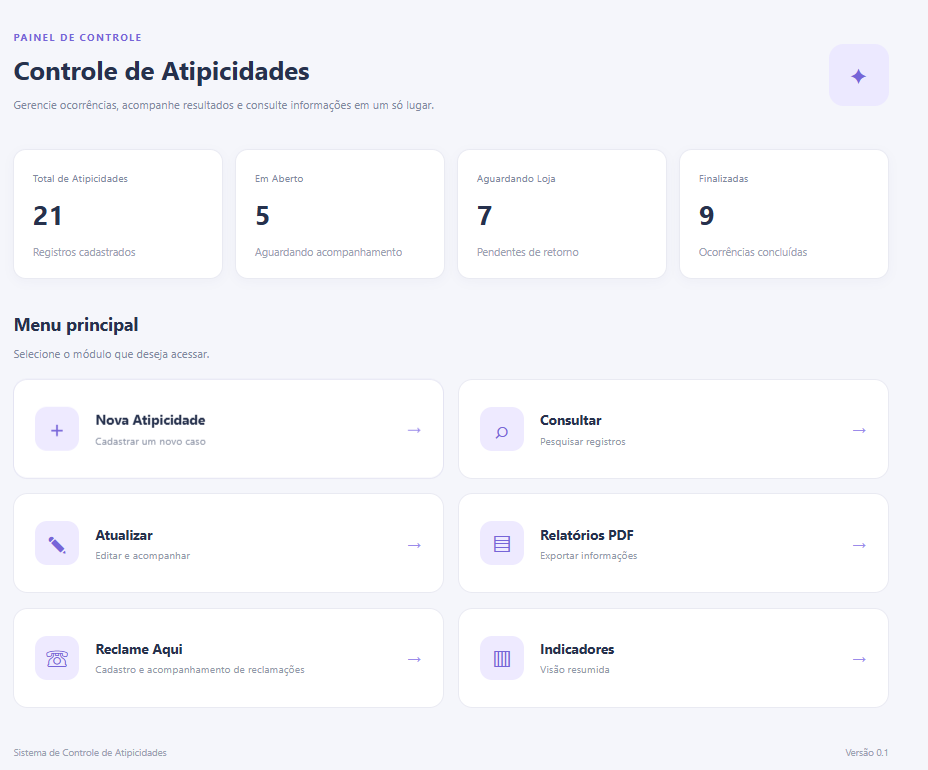
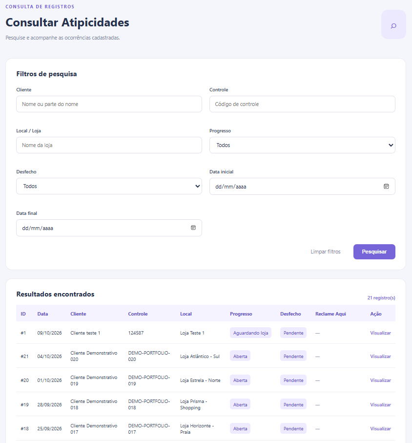
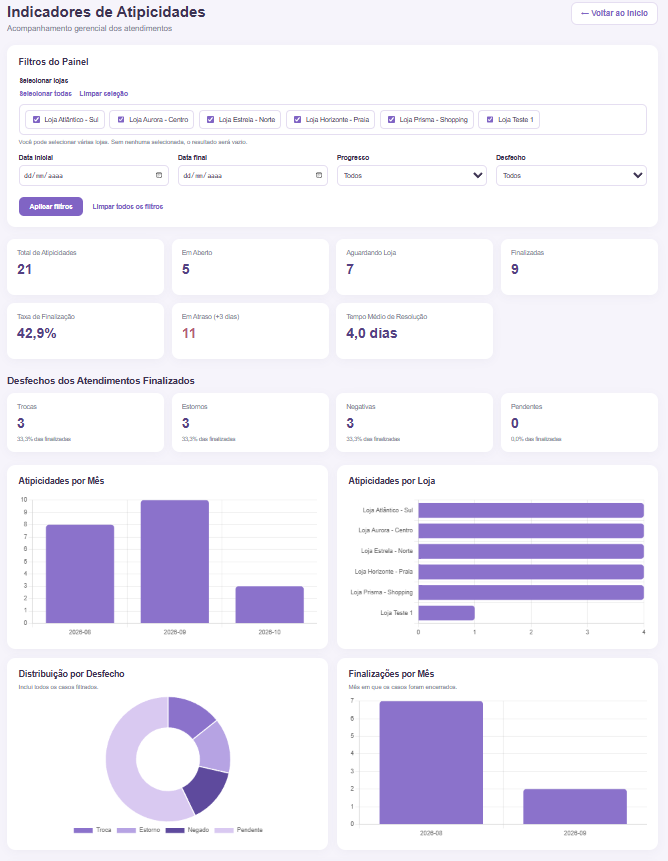
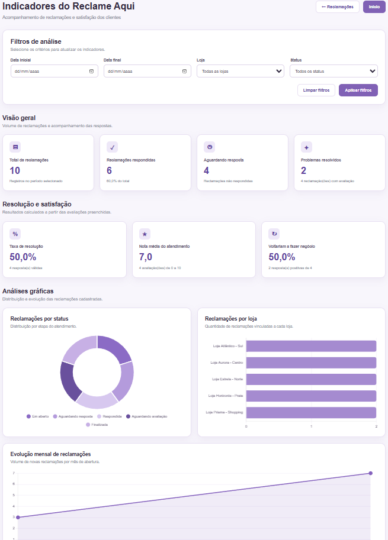
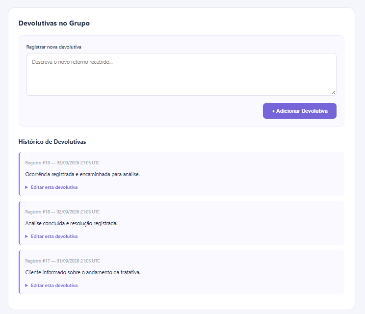
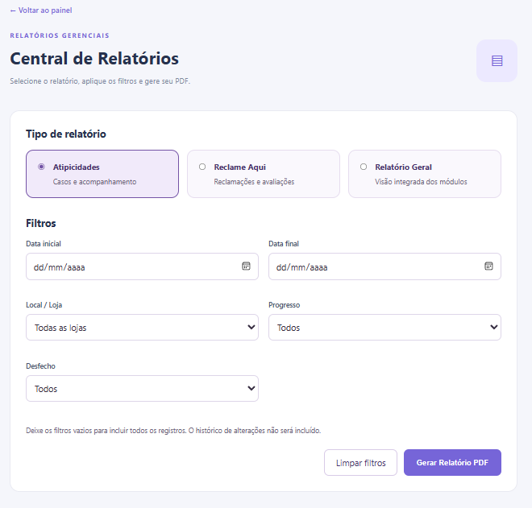
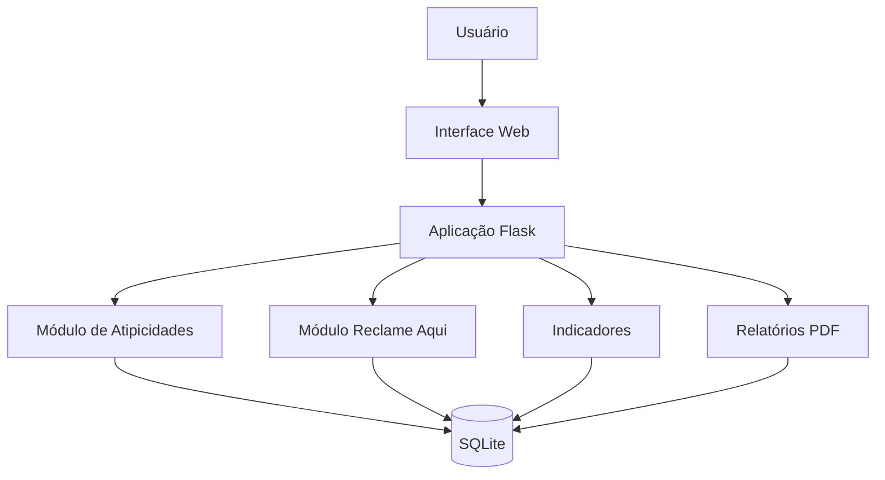

# Sistema de Controle de Atipicidades

### Gestão de ocorrências operacionais | Python | Flask | SQLite | Data Analytics

Aplicação local desenvolvida em Python para centralizar o registro, acompanhamento e análise de atipicidades operacionais e reclamações de consumidores.

O projeto reúne funcionalidades de gestão de registros, rastreabilidade de alterações, indicadores gerenciais e geração automatizada de relatórios, utilizando um banco de dados relacional.

Seu desenvolvimento integra conceitos de **automação de processos, auditoria, modelagem de dados e Business Intelligence**.

---

## 1. Visão geral

O Sistema de Controle de Atipicidades foi desenvolvido para demonstrar como uma solução tecnológica pode apoiar a organização e o acompanhamento de informações operacionais.

A aplicação permite registrar ocorrências, documentar devolutivas, acompanhar a evolução dos casos e consultar indicadores que auxiliam na identificação de pendências e na análise dos resultados.

O sistema também possui um módulo específico para acompanhamento de reclamações do Reclame Aqui, permitindo registros independentes ou vinculados às atipicidades.

A solução funciona localmente, por meio de uma interface web, com persistência de dados em SQLite.

## 2. Problema de negócio

O acompanhamento de ocorrências operacionais pode envolver informações distribuídas em diferentes controles, dificultando:

- A centralização e a padronização dos registros.
- A identificação de ocorrências pendentes.
- O acompanhamento das tratativas realizadas.
- A rastreabilidade das alterações.
- A consolidação de informações para relatórios gerenciais.
- A análise de indicadores operacionais.

O projeto propõe uma aplicação centralizada para estruturar essas informações e facilitar sua consulta e análise.

## 3. Funcionalidades

### Controle de Atipicidades

- Cadastro e consulta de ocorrências.
- Atualização das informações registradas.
- Acompanhamento do progresso dos casos.
- Classificação dos desfechos.
- Registro e edição de devolutivas.
- Histórico de alterações.
- Consulta de detalhes das ocorrências.

### Módulo Reclame Aqui

- Cadastro e acompanhamento de reclamações.
- Vinculação opcional a uma atipicidade.
- Registro de respostas e retornos.
- Acompanhamento do status das reclamações.
- Registro de resolução e avaliação do atendimento.
- Consulta e atualização dos registros.

### Indicadores gerenciais

- Total de ocorrências.
- Distribuição por progresso e desfecho.
- Acompanhamento de pendências.
- Análises por loja e período.
- Indicadores de reclamações respondidas.
- Taxas de resposta e resolução.
- Avaliações de atendimento.
- Visualizações gráficas para acompanhamento operacional.

### Relatórios

- Relatórios PDF individuais de atipicidades.
- Relatórios PDF individuais de reclamações.
- Relatórios consolidados de atipicidades.
- Relatórios consolidados do Reclame Aqui.
- Relatório geral de acompanhamento.
- Filtros para seleção das informações.


## Demonstração do sistema

As imagens abaixo apresentam as principais funcionalidades da aplicação, utilizando dados fictícios exclusivamente para demonstração.

### Painel inicial

Visão geral das atipicidades cadastradas e acesso aos módulos do sistema.



### Consulta de atipicidades

Pesquisa e acompanhamento de registros por cliente, controle, loja, progresso, desfecho e período.



### Indicadores de atipicidades

Dashboard gerencial com indicadores de acompanhamento, taxa de finalização, pendências, tempo médio de resolução e distribuição das ocorrências.



### Indicadores do Reclame Aqui

Painel de análise de reclamações, respostas, resolução, satisfação e evolução mensal.



### Histórico de devolutivas

Registro e acompanhamento de retornos relacionados às ocorrências.



### Central de Relatórios

Seleção de relatórios e aplicação de filtros para geração de documentos PDF.



## 4. Tecnologias utilizadas

| Tecnologia | Aplicação no projeto |
|---|---|
| Python | Desenvolvimento da lógica da aplicação |
| Flask | Estrutura da aplicação web e gerenciamento das rotas |
| SQLite | Armazenamento relacional dos dados |
| SQL | Consultas, filtros e operações no banco |
| HTML | Estrutura das páginas |
| CSS | Estilização da interface |
| JavaScript | Interações e visualizações no navegador |
| ReportLab | Geração automatizada de relatórios PDF |
| PyInstaller | Empacotamento da aplicação para Windows |
| GitHub Actions | Automação da geração do executável |
| Git e GitHub | Versionamento e organização do código |

## 5. Arquitetura da solução

O sistema utiliza uma arquitetura local, na qual o navegador se comunica com uma aplicação Flask responsável pelo processamento das requisições.

Os dados são armazenados em um banco SQLite, enquanto os módulos de relatórios consultam as informações necessárias para gerar documentos PDF.



### Organização do código

| Arquivo ou diretório | Responsabilidade |
|---|---|
| `app.py` | Aplicação principal e rotas de atipicidades |
| `reclame_aqui.py` | Funcionalidades de acompanhamento de reclamações |
| `relatorios_pdf.py` | Geração de relatórios individuais |
| `central_relatorios.py` | Geração de relatórios consolidados |
| `database/` | Conexão, estrutura e inicialização do banco de dados |
| `templates/` | Páginas HTML |
| `static/` | Arquivos de interface |
| `iniciar_sistema.py` | Inicialização local e abertura do navegador |
| `.github/workflows/` | Automação de compilação do executável |


## Documentação técnica

A documentação do projeto apresenta o problema de negócio que motivou o desenvolvimento da solução, a estrutura dos dados, a arquitetura da aplicação e as regras de cálculo dos indicadores gerenciais.

| Documento | Descrição |
|---|---|
| [01 — Contexto de Negócio e Requisitos](docs/01-contexto-negocio.md) | Problema identificado, objetivos, escopo, requisitos funcionais e regras de negócio. |
| [02 — Modelagem de Dados](docs/02-modelagem-dados.md) | Estrutura do banco SQLite, relacionamentos, diagrama entidade-relacionamento e dicionário de dados. |
| [03 — Arquitetura Técnica](docs/03-arquitetura.md) | Organização dos módulos, fluxo da aplicação, persistência, geração de relatórios e executável Windows. |
| [04 — Indicadores e Regras de Cálculo](docs/04-indicadores.md) | Definição dos KPIs, fórmulas, filtros, consultas SQL e interpretação dos indicadores. |

A documentação foi elaborada para demonstrar as decisões técnicas e analíticas envolvidas na transformação de uma necessidade operacional em uma solução de acompanhamento gerencial.


## 6. Como executar

### Pré-requisitos

- Python 3.12 ou versão compatível.
- Git, caso deseje clonar o repositório.

### Clonar o projeto

```bash
git clone https://github.com/AlleLira/sistema-controle-atipicidades.git
cd sistema-controle-atipicidades
```

### Instalar as dependências

```bash
python -m pip install -r requirements.txt
```

### Iniciar a aplicação

```bash
python iniciar_sistema.py
```

A aplicação estará disponível em:

**http://127.0.0.1:5000**

O navegador será aberto automaticamente quando possível.

### Executável Windows

O projeto também possui um fluxo de compilação automatizado com GitHub Actions e PyInstaller.

O executável permite iniciar a aplicação em um computador Windows sem a necessidade de instalar manualmente o Python.

Para utilizá-lo, é necessário extrair o pacote completo, manter seus arquivos juntos e executar `Controle de Atipicidades.exe`.

## 7. Banco de dados

O projeto utiliza SQLite para armazenar as informações localmente.

As principais tabelas são:

- `atipicidades`: registros das ocorrências.
- `devolutivas`: informações de acompanhamento vinculadas às ocorrências.
- `historico_edicoes`: registro de alterações.
- `reclame_aqui`: acompanhamento de reclamações, com vínculo opcional às atipicidades.

O banco de dados é inicializado automaticamente quando necessário.

Os arquivos de dados locais são excluídos do versionamento por meio do `.gitignore`.

**Importante:** o repositório não deve conter dados reais de clientes, informações corporativas confidenciais ou credenciais.

## 8. Decisões técnicas

### Persistência local

O SQLite foi escolhido por permitir armazenamento estruturado sem exigir a instalação e administração de um servidor de banco de dados.

### Separação de responsabilidades

As funcionalidades de reclamações, geração de relatórios e acesso aos dados foram organizadas em módulos específicos para facilitar a manutenção e evolução do projeto.

### Rastreabilidade

O histórico de edições permite acompanhar alterações realizadas nas informações operacionais.

### Distribuição para Windows

A utilização do PyInstaller e do GitHub Actions permite automatizar a geração de um pacote executável para Windows.

## 9. Evoluções planejadas

- Integração do banco de dados ao Power BI.
- Ampliação das análises gerenciais.
- Implementação de rotinas de backup e recuperação dos dados.
- Melhorias de segurança e distribuição da aplicação.
- Ampliação da documentação técnica.

## 10. Documentação

A documentação complementar será disponibilizada na pasta `docs/`, incluindo:

- Contexto de negócio e requisitos.
- Modelagem do banco de dados.
- Arquitetura técnica.
- Indicadores e regras de cálculo.

## 11. Autoria

**Alessandra Lira**

Profissional de Análise de Dados e Business Intelligence, com experiência em auditoria, automação de processos, indicadores gerenciais e desenvolvimento de soluções orientadas a dados.

- [GitHub](https://github.com/AlleLira)
- [LinkedIn](https://www.linkedin.com/in/alessandra-lira-oliveira/)

---

**Projeto de portfólio voltado à aplicação prática de Python, SQL, automação e análise de dados na resolução de problemas operacionais.**
