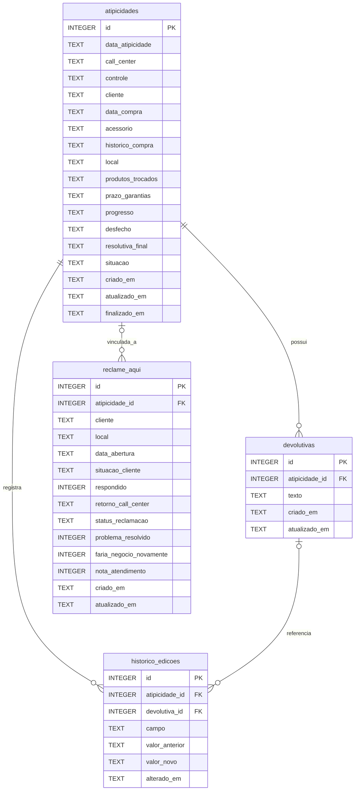

# Modelagem do Banco de Dados

## Sistema de Controle de Atipicidades

**Banco de dados:** SQLite  
**Modelo:** Relacional  
**Linguagem de consulta:** SQL  
**Quantidade de tabelas principais:** 4

---

## 1. Visão geral

O Sistema de Controle de Atipicidades utiliza um banco de dados SQLite para armazenar e relacionar informações operacionais.

A modelagem foi organizada para permitir:

- Cadastro e acompanhamento de atipicidades.
- Registro de múltiplas devolutivas por ocorrência.
- Rastreabilidade das alterações realizadas.
- Acompanhamento de reclamações de consumidores.
- Associação opcional entre reclamações e atipicidades.
- Consultas SQL para indicadores e relatórios gerenciais.

O banco é inicializado automaticamente pela aplicação.

## 2. Diagrama Entidade-Relacionamento (DER)



### Legenda

- **PK (Primary Key):** chave primária que identifica cada registro.
- **FK (Foreign Key):** chave estrangeira utilizada para estabelecer relacionamentos.
- **1:N:** relacionamento de um para muitos.
- **Opcional:** relacionamento que permite ausência de vínculo.

## 3. Dicionário de dados

### 3.1. Tabela `atipicidades`

Tabela principal responsável pelo armazenamento das ocorrências.

| Campo | Tipo SQLite | Descrição |
|---|---|---|
| id | INTEGER | Identificador único, chave primária |
| data_atipicidade | TEXT | Data da ocorrência |
| call_center | TEXT | Informação de atendimento |
| controle | TEXT | Código de controle |
| cliente | TEXT | Identificação do cliente |
| data_compra | TEXT | Data da compra |
| acessorio | TEXT | Produto ou acessório relacionado |
| historico_compra | TEXT | Informação de valor da compra |
| local | TEXT | Loja ou local |
| produtos_trocados | TEXT | Informações sobre trocas |
| prazo_garantias | TEXT | Informação sobre garantias |
| progresso | TEXT | Etapa de acompanhamento |
| desfecho | TEXT | Resultado da tratativa |
| resolutiva_final | TEXT | Descrição da resolução |
| situacao | TEXT | Descrição da situação |
| criado_em | TEXT | Data e hora de criação |
| atualizado_em | TEXT | Data e hora da última atualização |
| finalizado_em | TEXT | Data e hora de finalização |

**Restrições:**

- `id` é chave primária autoincremental.
- `data_atipicidade` é obrigatória.
- `cliente` é obrigatório.
- `progresso` é obrigatório, com valor padrão `Aberta`.
- `desfecho` é obrigatório, com valor padrão `Pendente`.

Valores permitidos para `progresso`:

- `Aberta`
- `Aguardando loja`
- `Finalizado`

Valores permitidos para `desfecho`:

- `Pendente`
- `Troca`
- `Estorno`
- `Negado`

Esses valores são restringidos por cláusulas `CHECK` na estrutura da tabela.

### 3.2. Tabela `devolutivas`

Armazena os retornos e informações de acompanhamento associados às atipicidades.

| Campo | Tipo SQLite | Descrição |
|---|---|---|
| id | INTEGER | Identificador único, chave primária |
| atipicidade_id | INTEGER | Chave estrangeira da atipicidade |
| texto | TEXT | Conteúdo da devolutiva |
| criado_em | TEXT | Data e hora de criação |
| atualizado_em | TEXT | Data e hora da atualização |

**Relacionamento:**

`devolutivas.atipicidade_id` referencia `atipicidades.id`.

Uma atipicidade pode possuir várias devolutivas.

Cada devolutiva deve estar associada a uma atipicidade existente.

### 3.3. Tabela `historico_edicoes`

Registra alterações realizadas nas informações do sistema.

| Campo | Tipo SQLite | Descrição |
|---|---|---|
| id | INTEGER | Identificador único, chave primária |
| atipicidade_id | INTEGER | Atipicidade relacionada |
| devolutiva_id | INTEGER | Devolutiva relacionada, quando aplicável |
| campo | TEXT | Campo alterado |
| valor_anterior | TEXT | Valor antes da alteração |
| valor_novo | TEXT | Valor após a alteração |
| alterado_em | TEXT | Data e hora da alteração |

**Relacionamentos:**

- `atipicidade_id` referencia `atipicidades.id`.
- `devolutiva_id` referencia `devolutivas.id`, quando informado.

O campo `devolutiva_id` é opcional, pois o histórico também registra alterações diretamente nos campos das atipicidades.

### 3.4. Tabela `reclame_aqui`

Armazena informações de acompanhamento das reclamações de consumidores.

| Campo | Tipo SQLite | Descrição |
|---|---|---|
| id | INTEGER | Identificador único, chave primária |
| atipicidade_id | INTEGER | Vínculo opcional com uma atipicidade |
| cliente | TEXT | Identificação do consumidor |
| local | TEXT | Loja ou local relacionado |
| data_abertura | TEXT | Data de abertura da reclamação |
| situacao_cliente | TEXT | Descrição da reclamação |
| respondido | INTEGER | Indicador de resposta |
| retorno_call_center | TEXT | Retorno registrado |
| status_reclamacao | TEXT | Etapa de acompanhamento |
| problema_resolvido | INTEGER | Indicador de resolução |
| faria_negocio_novamente | INTEGER | Intenção de realizar novos negócios |
| nota_atendimento | INTEGER | Avaliação do atendimento |
| criado_em | TEXT | Data e hora de criação |
| atualizado_em | TEXT | Data e hora de atualização |

**Restrições:**

- `id` é chave primária autoincremental.
- `data_abertura` é obrigatória.
- `respondido` é obrigatório, com padrão `0`.
- `status_reclamacao` é obrigatório, com padrão `Em aberto`.
- `atipicidade_id` aceita valores nulos.

A validação de status, respostas e notas é realizada na camada da aplicação.

## 4. Relacionamentos

| Origem | Destino | Cardinalidade | Regra |
|---|---|---|---|
| atipicidades | devolutivas | 1:N | Uma ocorrência pode ter várias devolutivas |
| atipicidades | historico_edicoes | 1:N | Uma ocorrência pode ter várias alterações |
| devolutivas | historico_edicoes | 1:N opcional | Uma alteração pode referenciar uma devolutiva |
| atipicidades | reclame_aqui | 1:N opcional | Uma reclamação pode estar vinculada a uma ocorrência |

A associação entre `reclame_aqui` e `atipicidades` é opcional.

Isso permite registrar reclamações independentes, sem exigir a existência de uma atipicidade correspondente.

## 5. Integridade dos dados

### 5.1. Chaves primárias

Todas as tabelas possuem identificadores únicos do tipo `INTEGER PRIMARY KEY AUTOINCREMENT`.

### 5.2. Chaves estrangeiras

O banco utiliza chaves estrangeiras para relacionar registros e preservar a integridade referencial.

As conexões habilitam:

```sql
PRAGMA foreign_keys = ON;
```

### 5.3. Restrições de domínio

Os campos `progresso` e `desfecho`, da tabela `atipicidades`, possuem restrições `CHECK` para limitar os valores permitidos.

Outras validações são realizadas pelo código Python antes da gravação.

### 5.4. Datas e valores

O SQLite utiliza campos `TEXT` para armazenar as datas e os horários do sistema.

A aplicação utiliza representações compatíveis com o padrão ISO, facilitando consultas e ordenações.

O campo `historico_compra` também é armazenado como `TEXT`, com validação e padronização realizadas na aplicação.

Essa escolha deve ser considerada em futuras integrações analíticas, especialmente na conversão para tipos numéricos.

## 6. Índices

A estrutura atual possui os seguintes índices explícitos:

| Índice | Tabela | Campo |
|---|---|---|
| idx_atipicidades_cliente | atipicidades | cliente |
| idx_atipicidades_controle | atipicidades | controle |
| idx_devolutivas_atipicidade | devolutivas | atipicidade_id |
| idx_reclame_aqui_atipicidade | reclame_aqui | atipicidade_id |
| idx_reclame_aqui_data | reclame_aqui | data_abertura |

Os índices apoiam consultas por cliente, controle, vínculos entre registros e data de abertura das reclamações.

## 7. Consultas SQL de exemplo

### 7.1. Quantidade de atipicidades por progresso

```sql
SELECT
    progresso,
    COUNT(*) AS total
FROM atipicidades
GROUP BY progresso
ORDER BY total DESC;
```

### 7.2. Quantidade de atipicidades por loja

```sql
SELECT
    local,
    COUNT(*) AS total
FROM atipicidades
GROUP BY local
ORDER BY total DESC;
```

### 7.3. Atipicidades e quantidade de devolutivas

```sql
SELECT
    a.id,
    a.cliente,
    a.progresso,
    COUNT(d.id) AS total_devolutivas
FROM atipicidades AS a
LEFT JOIN devolutivas AS d
    ON d.atipicidade_id = a.id
GROUP BY
    a.id,
    a.cliente,
    a.progresso
ORDER BY a.id;
```

### 7.4. Reclamações vinculadas a atipicidades

```sql
SELECT
    r.id AS reclamacao_id,
    r.status_reclamacao,
    a.id AS atipicidade_id,
    a.cliente,
    a.progresso
FROM reclame_aqui AS r
INNER JOIN atipicidades AS a
    ON a.id = r.atipicidade_id
ORDER BY r.id;
```

### 7.5. Reclamações independentes

```sql
SELECT
    id,
    cliente,
    data_abertura,
    status_reclamacao
FROM reclame_aqui
WHERE atipicidade_id IS NULL
ORDER BY data_abertura DESC;
```

## 8. Persistência e localização do banco

O arquivo principal do banco de dados é:

`atipicidades.db`

Durante o desenvolvimento, o banco é armazenado na pasta `data/`, localizada na raiz do projeto.

Na versão executável para Windows, a pasta `data/` é criada ao lado do executável.

Também é possível configurar outro diretório por meio da variável de ambiente:

`ATIPICIDADES_DATA_DIR`

O banco de dados local não deve ser versionado no GitHub.

## 9. Considerações para Business Intelligence

A modelagem relacional permite realizar consultas SQL para acompanhamento operacional e construção de indicadores.

Como evolução futura, está prevista a integração do SQLite ao Power BI.

Essa integração poderá apoiar:

- Análises de ocorrências por período.
- Monitoramento de pendências e finalizações.
- Distribuição de casos por loja.
- Acompanhamento de desfechos.
- Indicadores de resolução de reclamações.
- Análises históricas das informações.

Antes dessa integração, será importante definir as transformações necessárias para campos de datas, horários e valores armazenados como texto.

---

**Projeto:** Sistema de Controle de Atipicidades  
**Autoria:** Alessandra Lira  
**Documentação:** Modelagem relacional e estrutura SQLite
