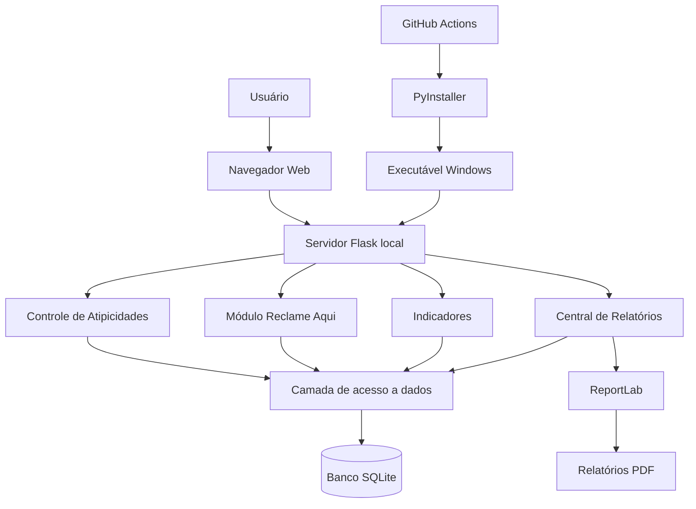
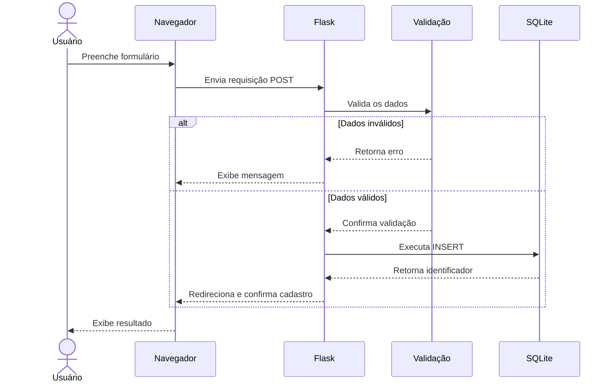
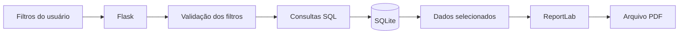
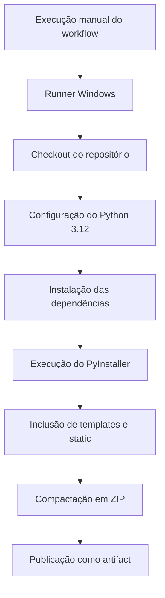

# Arquitetura Técnica

## Sistema de Controle de Atipicidades

**Linguagem principal:** Python  
**Framework web:** Flask  
**Banco de dados:** SQLite  
**Interface:** HTML, CSS e JavaScript  
**Relatórios:** ReportLab  
**Empacotamento:** PyInstaller  
**Automação de build:** GitHub Actions

---

## 1. Visão geral da arquitetura

O Sistema de Controle de Atipicidades é uma aplicação web de execução local, desenvolvida em Python com o framework Flask.

A aplicação utiliza uma interface acessada pelo navegador, permitindo que o usuário cadastre, consulte e acompanhe ocorrências operacionais.

Os dados são armazenados em um banco SQLite, enquanto os indicadores e relatórios são produzidos a partir de consultas SQL.

A solução foi organizada em módulos responsáveis pelas principais funcionalidades do sistema.

## 2. Diagrama de arquitetura

O diagrama representa a organização lógica da aplicação.

Os módulos utilizam a camada compartilhada de conexão ao banco de dados, enquanto a geração dos relatórios utiliza a biblioteca ReportLab.

## 3. Componentes da aplicação

### 3.1. Interface do usuário

A interface é construída com HTML, CSS e JavaScript, utilizando templates renderizados pelo Flask.

As páginas permitem:

- Navegação entre módulos.
- Cadastro de atipicidades.
- Consulta e atualização de registros.
- Acompanhamento de devolutivas.
- Gestão de reclamações.
- Visualização de indicadores.
- Geração de relatórios PDF.

Os arquivos de interface estão organizados principalmente nos diretórios:

- `templates/`
- `static/`

### 3.2. Aplicação Flask

O arquivo `app.py` é o componente central da aplicação.

Suas responsabilidades incluem:

- Inicialização do Flask.
- Configuração dos diretórios de templates e arquivos estáticos.
- Inicialização do banco de dados.
- Registro dos Blueprints.
- Definição de rotas.
- Recebimento e validação de formulários.
- Execução de operações SQL.
- Renderização das páginas.
- Processamento de indicadores de atipicidades.

O sistema utiliza rotas HTTP para conectar as ações realizadas no navegador à lógica Python.

### 3.3. Módulo de Atipicidades

O controle principal de atipicidades está implementado em `app.py`.

O módulo contempla:

- Cadastro de novas ocorrências.
- Consulta com filtros.
- Atualização de informações.
- Registro de devolutivas.
- Histórico de alterações.
- Acompanhamento de progresso e desfecho.
- Indicadores gerenciais.

### 3.4. Módulo Reclame Aqui

O arquivo `reclame_aqui.py` implementa um Blueprint Flask específico para o acompanhamento de reclamações.

O módulo permite:

- Cadastro de reclamações.
- Consulta e atualização de registros.
- Vinculação opcional com atipicidades.
- Acompanhamento de respostas.
- Registro de resolução e avaliação.
- Visualização de indicadores.

A separação por Blueprint facilita a organização das rotas e a manutenção do código.

### 3.5. Módulo de Relatórios

A geração de documentos está distribuída entre dois arquivos principais.

**`relatorios_pdf.py`**

Responsável pelas funcionalidades de geração de relatórios individuais e pelos componentes reutilizáveis de formatação PDF.

**`central_relatorios.py`**

Responsável pela central de relatórios, aplicação de filtros, consultas consolidadas e geração dos documentos correspondentes.

A biblioteca ReportLab é utilizada para construir os PDFs.

### 3.6. Camada de persistência

A persistência é realizada com SQLite.

Os arquivos principais são:

- `database/db.py`
- `database/reclame_aqui_db.py`

O arquivo `db.py` contém as funções de conexão e inicialização das tabelas principais.

O arquivo `reclame_aqui_db.py` contém a inicialização da estrutura relacionada às reclamações.

As conexões habilitam a verificação de chaves estrangeiras e configuram um tempo de espera para operações no banco.

## 4. Fluxo de funcionamento

O fluxo básico de uma operação de cadastro é apresentado abaixo.

Esse fluxo representa o cadastro de uma atipicidade.

Antes da gravação, a aplicação verifica campos obrigatórios, datas, progresso, desfecho e valores monetários.

## 5. Organização do código

Os principais componentes da aplicação são:

| Arquivo ou diretório | Responsabilidade |
|---|---|
| `app.py` | Aplicação Flask e controle de atipicidades |
| `iniciar_sistema.py` | Inicialização local e abertura do navegador |
| `reclame_aqui.py` | Rotas e funcionalidades de reclamações |
| `central_relatorios.py` | Central de relatórios e filtros |
| `relatorios_pdf.py` | Geração e formatação de PDFs |
| `database/db.py` | Conexão e inicialização do SQLite |
| `database/reclame_aqui_db.py` | Estrutura de dados das reclamações |
| `templates/` | Páginas HTML |
| `static/` | Arquivos estáticos da interface |
| `requirements.txt` | Dependências Python |
| `.github/workflows/gerar-executavel.yml` | Automação do executável Windows |

## 6. Inicialização da aplicação

O sistema pode ser iniciado por meio do arquivo:

`iniciar_sistema.py`

Esse arquivo importa a aplicação Flask e executa o servidor local.

A configuração atual utiliza:

- Host: `127.0.0.1`
- Porta: `5000`
- Debug: desativado

O sistema verifica se o servidor está respondendo e tenta abrir automaticamente o navegador no endereço:

`http://127.0.0.1:5000`

Caso a abertura automática não funcione, o endereço pode ser acessado manualmente.

## 7. Armazenamento dos dados

O sistema utiliza o arquivo:

`atipicidades.db`

O diretório de armazenamento depende da forma de execução.

| Ambiente | Localização |
|---|---|
| Execução pelo código Python | Pasta `data/` na raiz do projeto |
| Execução pelo programa Windows | Pasta `data/` ao lado do executável |
| Diretório personalizado | Variável `ATIPICIDADES_DATA_DIR` |

O banco SQLite é utilizado tanto para os registros operacionais quanto para as consultas de indicadores e relatórios.

Os dados locais não devem ser enviados ao repositório público.

## 8. Geração de relatórios

O fluxo de geração dos relatórios utiliza consultas SQL e a biblioteca ReportLab.

A Central de Relatórios disponibiliza três modalidades:

1. Relatório de Atipicidades.
2. Relatório Reclame Aqui.
3. Relatório Geral de Acompanhamento.

Os documentos são gerados a partir dos dados selecionados, considerando os filtros aplicáveis.

## 9. Empacotamento para Windows

A aplicação utiliza PyInstaller para gerar uma distribuição executável.

O processo é automatizado pelo GitHub Actions.

O workflow está localizado em:

`.github/workflows/gerar-executavel.yml`

### Etapas do processo

O workflow utiliza a opção `--onedir`, gerando uma pasta de distribuição com o executável e seus arquivos de suporte.

O resultado é compactado em um arquivo ZIP e disponibilizado como artifact da execução no GitHub Actions.

O executável permite iniciar a aplicação sem executar manualmente os comandos Python.

## 10. Decisões técnicas

### 10.1. Python e Flask

A escolha do Flask permite desenvolver uma aplicação web com uma estrutura relativamente simples, adequada ao escopo do projeto.

### 10.2. SQLite

O SQLite foi escolhido para a persistência local, dispensando a configuração de um servidor de banco de dados independente.

Essa abordagem atende ao cenário atual de utilização local.

### 10.3. Blueprints

Os módulos de Reclame Aqui e relatórios foram organizados em Blueprints.

Essa separação contribui para a manutenção e evolução do sistema.

### 10.4. ReportLab

O ReportLab permite gerar documentos PDF programaticamente, com controle de formatação, tabelas e organização das informações.

### 10.5. GitHub Actions e PyInstaller

A automação do build permite gerar uma distribuição Windows a partir do código versionado, tornando o processo de empacotamento reproduzível.

## 11. Limitações e melhorias futuras

A versão atual foi desenvolvida para execução local.

Algumas evoluções possíveis são:

- Implementação de autenticação e controle de acesso.
- Configuração segura da chave secreta do Flask.
- Rotinas automatizadas de backup.
- Testes automatizados.
- Separação adicional entre regras de negócio e rotas.
- Integração com Power BI.
- Melhorias no processo de distribuição e atualização.

A arquitetura atual não deve ser interpretada como uma solução de acesso multiusuário pela internet.

A disponibilização em rede exigiria uma avaliação adicional de segurança, autenticação, implantação e persistência.

## 12. Considerações finais

O Sistema de Controle de Atipicidades demonstra a aplicação prática de conhecimentos em desenvolvimento Python, persistência relacional, organização modular, automação de relatórios e distribuição de software.

A arquitetura conecta necessidades operacionais a uma solução tecnológica que permite registrar informações, acompanhar processos e produzir indicadores para análise gerencial.

O projeto também estabelece uma base para futuras evoluções relacionadas a Business Intelligence e análise de dados.

---

**Projeto:** Sistema de Controle de Atipicidades  
**Autoria:** Alessandra Lira  
**Documentação:** Arquitetura Técnica
