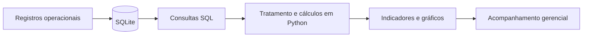

# Indicadores e Regras de Cálculo

## Sistema de Controle de Atipicidades

**Área:** Análise de Dados e Business Intelligence  
**Fonte de dados:** SQLite  
**Processamento:** Python e SQL  
**Visualização:** Dashboards na aplicação Flask

---

## 1. Objetivo

Os indicadores do Sistema de Controle de Atipicidades foram desenvolvidos para transformar registros operacionais em informações gerenciais.

Os dashboards permitem acompanhar o volume de ocorrências, identificar pendências, analisar o tempo de resolução e avaliar os resultados das tratativas.

O sistema possui dois conjuntos principais de indicadores:

- Indicadores de Atipicidades.
- Indicadores do Reclame Aqui.

Os cálculos são realizados a partir dos registros armazenados no banco SQLite e processados pela aplicação Python.

## 2. Fluxo analítico



## 3. Indicadores de Atipicidades

**Fonte:** Tabela `atipicidades`  
**Implementação:** Função `indicadores()` em `app.py`

### 3.1. Total de atipicidades

**Objetivo:** Identificar o volume de ocorrências cadastradas no período e nos filtros selecionados.

**Regra de cálculo:**

Total de atipicidades = Quantidade de registros selecionados.

**Interpretação:** Permite acompanhar o volume operacional e sua evolução ao longo do tempo.

### 3.2. Atipicidades abertas

**Objetivo:** Identificar ocorrências ainda classificadas como abertas.

**Regra de cálculo:**

Quantidade de registros em que `progresso = 'Aberta'`.

### 3.3. Aguardando loja

**Objetivo:** Acompanhar ocorrências que dependem de retorno ou tratativa da loja.

**Regra de cálculo:**

Quantidade de registros em que `progresso = 'Aguardando loja'`.

### 3.4. Atipicidades finalizadas

**Objetivo:** Identificar ocorrências com acompanhamento concluído.

**Regra de cálculo:**

Quantidade de registros em que `progresso = 'Finalizado'`.

### 3.5. Taxa de finalização

**Objetivo:** Medir a proporção de ocorrências finalizadas em relação ao total selecionado.

**Fórmula:**

Taxa de finalização (%) = (Atipicidades finalizadas / Total de atipicidades) × 100

Quando não existem registros, a aplicação retorna 0%.

**Exemplo fictício:**

- Total de atipicidades: 100
- Atipicidades finalizadas: 65

Taxa de finalização = (65 / 100) × 100 = **65%**

**Interpretação:** Demonstra a proporção de casos concluídos dentro do conjunto analisado.

### 3.6. Pendências acima de três dias

**Objetivo:** Identificar ocorrências não finalizadas que ultrapassaram três dias desde a data da atipicidade.

**Critérios:**

- O progresso é diferente de `Finalizado`.
- A diferença entre a data atual e `data_atipicidade` é superior a três dias.

**Regra de cálculo:**

Quantidade de ocorrências não finalizadas com idade superior a três dias.

**Observação:** O cálculo considera dias corridos, não dias úteis.

O indicador representa uma regra de acompanhamento operacional e não deve ser interpretado automaticamente como descumprimento de um SLA contratual.

### 3.7. Tempo médio de resolução

**Objetivo:** Medir o tempo médio decorrido entre a data da atipicidade e a data de finalização.

**Fórmula:**

Tempo médio de resolução = Soma dos dias de resolução / Quantidade de casos válidos

**Critérios de inclusão:**

- Progresso igual a `Finalizado`.
- Campo `finalizado_em` preenchido.
- Datas válidas.
- Diferença entre finalização e ocorrência maior ou igual a zero.

**Exemplo fictício:**

| Ocorrência | Tempo de resolução |
|---|---:|
| Caso 1 | 2 dias |
| Caso 2 | 4 dias |
| Caso 3 | 6 dias |

Tempo médio = (2 + 4 + 6) / 3 = **4 dias**

Casos sem datas válidas para o cálculo são desconsiderados.

Quando não existem casos elegíveis, a média fica indisponível.

### 3.8. Distribuição por desfecho

**Objetivo:** Identificar os resultados das tratativas.

Os desfechos possíveis são:

- Pendente.
- Troca.
- Estorno.
- Negado.

O sistema calcula a quantidade de registros por desfecho e também a distribuição dos desfechos entre as ocorrências finalizadas.

### 3.9. Distribuição por loja

**Objetivo:** Identificar a concentração das ocorrências por unidade.

**Regra de cálculo:**

Contagem de registros agrupados pelo campo `local`.

Registros sem identificação de loja são classificados como `Não informada`.

### 3.10. Evolução mensal

O sistema organiza as ocorrências pelo mês da data da atipicidade.

Também calcula a quantidade de finalizações por mês, utilizando `finalizado_em` quando disponível e válido.

Isso permite comparar o volume de ocorrências registradas com o volume de finalizações ao longo do tempo.

## 4. Indicadores do Reclame Aqui

**Fonte:** Tabela `reclame_aqui`  
**Implementação:** Função `indicadores()` em `reclame_aqui.py`

### 4.1. Total de reclamações

**Objetivo:** Acompanhar o volume de reclamações cadastradas.

**Regra de cálculo:**

Quantidade de reclamações selecionadas pelos filtros.

### 4.2. Reclamações respondidas

**Objetivo:** Identificar quantas reclamações possuem resposta registrada.

**Regra de cálculo:**

Quantidade de registros em que `respondido = 1`.

### 4.3. Reclamações aguardando resposta

**Objetivo:** Identificar reclamações sem resposta registrada.

**Fórmula:**

Pendentes de resposta = Total de reclamações - Reclamações respondidas

### 4.4. Taxa de resposta

**Objetivo:** Medir a proporção de reclamações respondidas.

**Fórmula:**

Taxa de resposta (%) = (Reclamações respondidas / Total de reclamações) × 100

Quando não existem reclamações, o indicador fica indisponível.

### 4.5. Reclamações resolvidas

**Objetivo:** Identificar reclamações avaliadas como resolvidas.

**Regra de cálculo:**

Quantidade de registros em que `problema_resolvido = 1`.

O sistema considera para a avaliação de resolução os registros em que `problema_resolvido` está preenchido com 0 ou 1.

### 4.6. Taxa de resolução

**Objetivo:** Medir a proporção de reclamações resolvidas entre aquelas que possuem avaliação de resolução.

**Fórmula:**

Taxa de resolução (%) = (Reclamações resolvidas / Reclamações com resolução avaliada) × 100

**Exemplo fictício:**

- Total de reclamações: 20
- Reclamações com resolução avaliada: 12
- Reclamações resolvidas: 9

Taxa de resolução = (9 / 12) × 100 = **75%**

**Importante:** O denominador não é necessariamente o total de reclamações.

Reclamações sem avaliação de resolução não participam desse cálculo.

### 4.7. Nota média de atendimento

**Objetivo:** Acompanhar a avaliação média do atendimento.

**Fórmula:**

Nota média = Soma das notas informadas / Quantidade de notas informadas

A aplicação considera somente registros em que `nota_atendimento` não é nulo.

A validação do formulário permite notas entre 0 e 10.

Quando não existem avaliações, a média fica indisponível.

### 4.8. Intenção de voltar a fazer negócio

**Objetivo:** Avaliar a proporção de consumidores que indicaram que fariam negócio novamente.

**Fórmula:**

Taxa de intenção de retorno (%) = (Respostas positivas / Total de respostas válidas) × 100

São consideradas respostas válidas os registros com:

- `faria_negocio_novamente = 1`
- `faria_negocio_novamente = 0`

Registros sem resposta são excluídos do denominador.

### 4.9. Distribuição por status

O sistema agrupa as reclamações conforme o campo `status_reclamacao`.

Os status utilizados pela aplicação são:

- Em aberto.
- Aguardando resposta.
- Respondida.
- Aguardando avaliação.
- Finalizada.

A contagem por status permite acompanhar a distribuição das reclamações entre as etapas de tratamento.

### 4.10. Reclamações por loja

O sistema identifica a loja utilizando preferencialmente o campo `local` da reclamação.

Quando esse campo está vazio e existe uma atipicidade vinculada, utiliza o local da atipicidade.

Quando nenhuma das fontes possui uma loja válida, o registro é classificado como `Não informada`.

### 4.11. Evolução mensal de reclamações

O sistema agrupa as reclamações pelo ano e mês do campo `data_abertura`.

Esse indicador permite acompanhar a evolução do volume de reclamações ao longo do tempo.

## 5. Filtros dos dashboards

### 5.1. Atipicidades

O dashboard de atipicidades permite filtrar por:

- Data inicial.
- Data final.
- Progresso.
- Desfecho.
- Lojas selecionadas.

O período é aplicado ao campo `data_atipicidade`.

### 5.2. Reclame Aqui

O dashboard de reclamações permite filtrar por:

- Data inicial.
- Data final.
- Loja.
- Status da reclamação.

O período é aplicado ao campo `data_abertura`.

**Importante:** Os indicadores são recalculados considerando os registros selecionados. Portanto, seus valores podem mudar conforme os filtros utilizados.

## 6. Consultas SQL de referência

As consultas abaixo exemplificam a lógica dos indicadores. Na aplicação, os filtros são incorporados às consultas e parte dos cálculos é realizada em Python.

### 6.1. Atipicidades por progresso

```sql
SELECT
    progresso,
    COUNT(*) AS total
FROM atipicidades
GROUP BY progresso
ORDER BY total DESC;
```

### 6.2. Taxa de finalização

```sql
SELECT
    COUNT(*) AS total,
    SUM(
        CASE
            WHEN progresso = 'Finalizado' THEN 1
            ELSE 0
        END
    ) AS finalizadas,
    ROUND(
        100.0 * SUM(
            CASE
                WHEN progresso = 'Finalizado' THEN 1
                ELSE 0
            END
        ) / NULLIF(COUNT(*), 0),
        2
    ) AS taxa_finalizacao
FROM atipicidades;
```

### 6.3. Pendências acima de três dias

```sql
SELECT
    COUNT(*) AS pendencias_acima_3_dias
FROM atipicidades
WHERE progresso != 'Finalizado'
  AND julianday('now', 'localtime')
      - julianday(data_atipicidade) >= 4;
```

Essa consulta exemplifica a contagem de ocorrências com quatro ou mais dias completos de diferença entre as datas. O cálculo oficial da aplicação utiliza objetos `date` do Python.

### 6.4. Tempo médio de resolução

```sql
SELECT
    ROUND(
        AVG(
            julianday(substr(finalizado_em, 1, 10))
            - julianday(data_atipicidade)
        ),
        2
    ) AS tempo_medio_dias
FROM atipicidades
WHERE progresso = 'Finalizado'
  AND finalizado_em IS NOT NULL
  AND julianday(substr(finalizado_em, 1, 10))
      >= julianday(data_atipicidade);
```

### 6.5. Taxa de resposta das reclamações

```sql
SELECT
    COUNT(*) AS total,
    SUM(
        CASE
            WHEN respondido = 1 THEN 1
            ELSE 0
        END
    ) AS respondidas,
    ROUND(
        100.0 * SUM(
            CASE
                WHEN respondido = 1 THEN 1
                ELSE 0
            END
        ) / NULLIF(COUNT(*), 0),
        2
    ) AS taxa_resposta
FROM reclame_aqui;
```

### 6.6. Taxa de resolução das reclamações

```sql
SELECT
    SUM(
        CASE
            WHEN problema_resolvido = 1 THEN 1
            ELSE 0
        END
    ) AS resolvidas,
    SUM(
        CASE
            WHEN problema_resolvido IN (0, 1) THEN 1
            ELSE 0
        END
    ) AS avaliadas,
    ROUND(
        100.0 * SUM(
            CASE
                WHEN problema_resolvido = 1 THEN 1
                ELSE 0
            END
        ) / NULLIF(
            SUM(
                CASE
                    WHEN problema_resolvido IN (0, 1) THEN 1
                    ELSE 0
                END
            ),
            0
        ),
        2
    ) AS taxa_resolucao
FROM reclame_aqui;
```

### 6.7. Nota média de atendimento

```sql
SELECT
    COUNT(nota_atendimento) AS total_avaliacoes,
    ROUND(AVG(nota_atendimento), 2) AS nota_media
FROM reclame_aqui;
```

### 6.8. Reclamações por mês

```sql
SELECT
    substr(data_abertura, 1, 7) AS mes,
    COUNT(*) AS total_reclamacoes
FROM reclame_aqui
GROUP BY substr(data_abertura, 1, 7)
ORDER BY mes;
```

## 7. Qualidade e interpretação dos indicadores

Para garantir uma interpretação adequada dos resultados, é importante considerar:

- **Integridade:** os registros precisam possuir informações consistentes.
- **Completude:** avaliações não preenchidas não devem ser tratadas automaticamente como respostas negativas.
- **Temporalidade:** a data da ocorrência pode ser diferente da data de finalização.
- **Filtros:** indicadores devem ser comparados considerando o mesmo recorte de dados.
- **Denominadores:** taxas de resolução e intenção de retorno utilizam somente avaliações válidas.
- **Rastreabilidade:** o histórico de alterações permite acompanhar modificações realizadas nos registros.

A documentação das regras de cálculo facilita a validação dos indicadores e a reprodução das métricas em ferramentas analíticas.

## 8. Aplicação em Business Intelligence

Os indicadores implementados representam uma primeira camada de análise operacional.

Como evolução futura, os dados poderão ser utilizados no Power BI para construir análises mais detalhadas.

Possíveis aplicações incluem:

- Comparação mensal e anual de ocorrências.
- Evolução da taxa de finalização.
- Análise de tempo médio de resolução por loja.
- Monitoramento de pendências.
- Comparação de desfechos.
- Análise de resolução e satisfação.
- Identificação de padrões e oportunidades de melhoria.

A integração com Power BI está planejada e ainda não faz parte da implementação atual.

## 9. Considerações finais

A definição de indicadores envolve mais do que a construção de gráficos.

É necessário compreender o problema de negócio, identificar os campos relevantes, estabelecer regras de cálculo, tratar dados ausentes e garantir que os resultados sejam interpretados corretamente.

O Sistema de Controle de Atipicidades aplica esses princípios ao acompanhamento de ocorrências e reclamações, demonstrando competências em SQL, Python, análise de dados e Business Intelligence.

---

**Projeto:** Sistema de Controle de Atipicidades  
**Autoria:** Alessandra Lira  
**Documentação:** Indicadores e Regras de Cálculo
